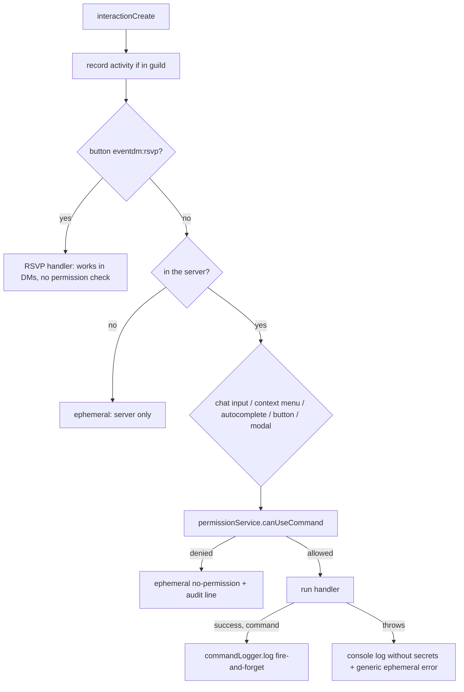
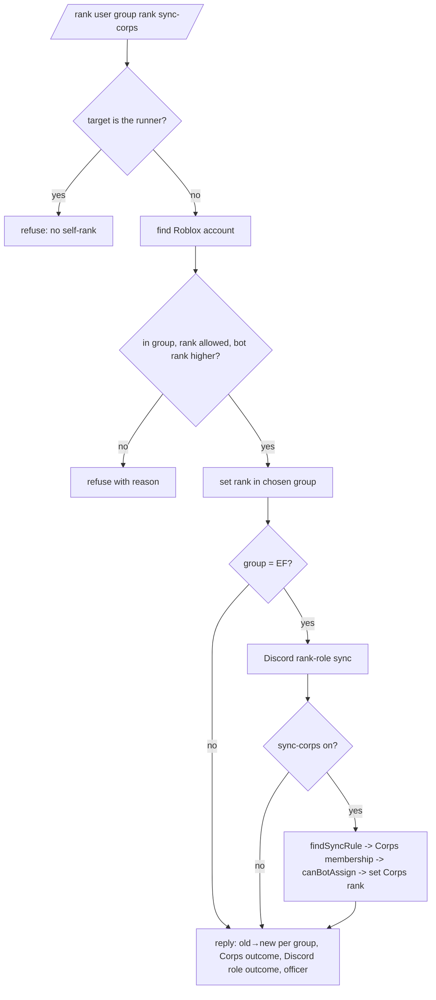
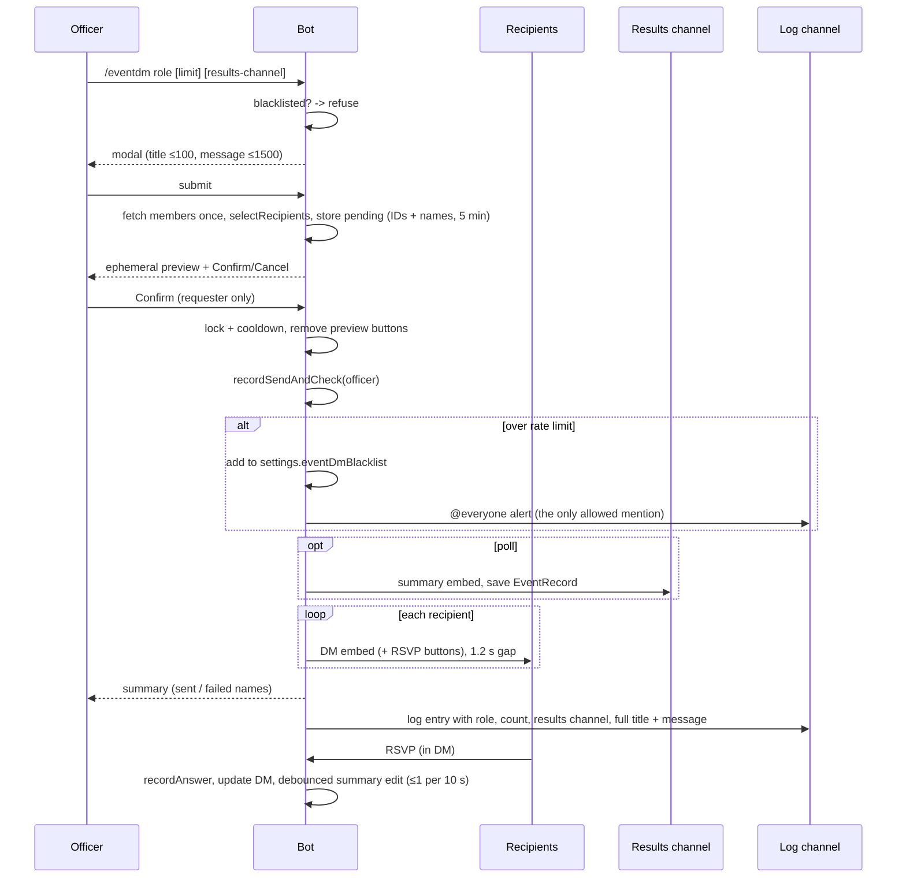

# Design (living, as built)

> **Living document.** Describes how GroupManagementBot is built today. Migrated from `.kiro/design.md` on
> 2026-10-02 and corrected against the code (the Kiro version predated tasks 15–27). Feature specs describe only
> their delta; `/spec-close` merges that delta here. Requirement references look like `R3.17`.

## Guiding rules

1. Layered: `commands` / `interactions` → `services` → `api` and `storage`. `ui`, `utils`, `config`, `i18n` may
   be imported by anyone. Never import upwards.
2. Shared logic lives in `services/`, `api/`, `ui/` or `utils/` — never in `main.ts` or `init.ts`.
3. Stay light: small EC2 instance. No big SDKs, bounded caches, minimal intents.
4. Stay readable: a junior developer can follow any file top to bottom (R15).
5. Never touch secrets: `.env.ci` is dotenvx-encrypted and stays that way (R14).

---

## Folder layout

```
src/
├─ init.ts                        # env validation; exports env, groups, getCorpsID() (legacy names kept)
├─ main.ts                        # composition root: client, stores, service wiring, router, activity, shutdown
├─ deploy-commands.ts             # registers slash + context-menu commands (owner runs manually)
├─ config/                        # DATA ONLY
│  ├─ constants.ts                # MANAGED_GROUPS, GroupKey, getManagedGroup, DISCORD_SERVER_ID, LIMITS
│  ├─ rankSync.ts                 # Rank Sync Table: EF rank ranges -> Corps role name (R3.15)
│  ├─ rankRoles.ts                # EF rank number -> Discord role ID (R3.19)
│  └─ theme.ts                    # THEME_COLORS, THEME_ICONS, POLL_ICONS, USERINFO_SECTION_EMOJIS (R19)
├─ i18n/
│  ├─ localizations.ts            # zh-CN description tables keyed by command -> option ("_" = command)
│  └─ applyLocalizations.ts       # walks a builder (incl. subcommands) and sets description localizations
├─ commands/                      # one command per file; exports data, access, execute [, autocomplete, configure]
│  ├─ index.ts                    # `commands` (slash) and `userContextMenus` registries
│  ├─ types.ts                    # AccessLevel, BotCommand, UserContextMenuCommand
│  ├─ ping.ts                     # /ping (public)
│  ├─ acceptuser.ts               # /accept
│  ├─ whois.ts                    # /whois
│  ├─ robloxinfo.ts               # "Roblox Info" user context menu
│  ├─ rankuser.ts                 # /rank (Corps sync + Discord rank-role sync + self-rank block)
│  ├─ eventdm.ts                  # /eventdm (validates, stores draft, opens modal)
│  ├─ eventdmexclusions.ts        # /eventdm-exclusions
│  ├─ userinfo.ts                 # /userinfo (single-embed grid card)
│  ├─ statssource.ts              # /stats-source (add/list/remove/edit/test + field-* subcommands)
│  ├─ statsalias.ts               # /stats-alias
│  ├─ roles.ts                    # /roles regiment|special-assignment|imperial-honour add|remove|list
│  ├─ permissions.ts              # /permissions (admin)
│  └─ log.ts                      # /log set|show (admin)
├─ interactions/
│  ├─ router.ts                   # sole interactionCreate handler
│  ├─ customId.ts                 # build/parse "feature:action:id[:extra]" (≤100 chars)
│  ├─ eventDmInteractions.ts      # eventdm modal, Confirm/Cancel, send loop, RSVP buttons, rate-limit alert
│  └─ statsSourceInteractions.ts  # statssource modal (endpoint URL + secret)
├─ api/                           # thin wrappers over the outside world; easy to fake
│  ├─ bloxlink.ts                 # Discord ID -> Roblox ID (typed failure reasons)
│  ├─ roblox.ts                   # noblox wrappers, username history, headshot, bot user ID
│  └─ statsEndpoint.ts            # Google Apps Script endpoint client + response guard + host allow-list
├─ services/                      # business logic; deps injected via create*(deps)
│  ├─ robloxAccount.ts            # createRobloxAccountLookup (cache 5 min / 200)
│  ├─ accountLookup.ts            # configured singleton: configureAccountLookup / getAccountLookup
│  ├─ robloxInfo.ts               # group rank lines + headshot for /whois, context menu, /userinfo
│  ├─ groupAccess.ts              # canBotAssign (pure)
│  ├─ rankSyncService.ts          # findSyncRule, validateRankSyncRules, findMissingCorpsRoles (pure)
│  ├─ rankRoleService.ts          # findRankRoleId, managedRankRoleIds, computeRankRoleChange (pure)
│  ├─ rankService.ts              # createRankService: set rank + optional Corps sync
│  ├─ rankServiceInstance.ts
│  ├─ permissionService.ts        # isAllowed (pure) + createPermissionService
│  ├─ activityTracker.ts          # last-active map, lazy save
│  ├─ activityTrackerInstance.ts
│  ├─ recipientSelector.ts        # selectRecipients (pure)
│  ├─ eventDmService.ts           # pending previews, lock/cooldown, send loop, per-officer rate limit
│  ├─ eventDmInstance.ts
│  ├─ pollService.ts              # recordAnswer, buildSummary, debounced summary edit
│  ├─ pollServiceInstance.ts
│  ├─ statsService.ts             # name list, ≤3 sources in flight, cache 60 s / 100
│  ├─ statsServiceInstance.ts
│  ├─ statsFields.ts              # add/remove/move/validate fields (pure)
│  ├─ statsFormatter.ts           # formatValue, formatRatio, buildStatCells, renderStatTable (pure)
│  ├─ commandLogger.ts            # buildLogSummary (pure) + createCommandLogger (log, alert)
│  └─ commandLoggerInstance.ts
├─ storage/
│  ├─ jsonFile.ts                 # load once, atomic save, .bak, write queue, corrupt-file policy
│  ├─ paths.ts                    # getDataDir() (DATA_DIR or <cwd>/data), dataFilePath()
│  ├─ settingsStore.ts            # SettingsStore { get, update }
│  ├─ eventStore.ts               # polls (≤20 records, ≤30 days)
│  └─ types.ts                    # Settings, StatsSource, StatField, RoleLabel, EventRecord, ActivityFile + defaults
├─ ui/
│  ├─ embeds.ts                   # success/warn/error, poll summary, event DM, Roblox info, user info card
│  └─ messages.ts                 # shared user-facing text
└─ utils/
   ├─ ttlCache.ts                 # bounded cache with lazy expiry, no timers
   ├─ sleep.ts
   └─ text.ts                     # truncate, normaliseName

data/                             # runtime, git-ignored: settings.json, events.json, activity.json (+ .bak)
```

**Wiring pattern.** `main.ts` `bootstrap()` creates the stores, then calls each `configureX(...)` once
(services' `*Instance.ts` modules and commands' `configure()` exports). Everything else reaches them through
`getX()`. `bootstrap()` throws on a corrupt `settings.json`/`events.json`, so the bot never logs in with bad data.

**Tests** sit beside the code as `*.test.ts` (23 files, ~200 tests). Only `src/main.test.ts` imports `init.ts`
and therefore needs the decrypted env; everything else runs with `npx vitest run --exclude src/main.test.ts`.

---

## Command module contract

```ts
// src/commands/types.ts
export type AccessLevel = "public" | "configurable" | "admin";

export type BotCommand = {
  data: { name: string; toJSON(): unknown };      // SlashCommandBuilder
  access: AccessLevel;
  execute(interaction: ChatInputCommandInteraction): Promise<void>;
  autocomplete?(interaction: AutocompleteInteraction): Promise<void>;
};

export type UserContextMenuCommand = {
  data: { name: string; toJSON(): unknown };      // ContextMenuCommandBuilder
  access: AccessLevel;
  execute(interaction: UserContextMenuCommandInteraction): Promise<void>;
};
```

Every command file:

- starts with the header comment:
  ```ts
  // /rank
  // Arguments: user, group (empire-francais | neuvieme-corps), rank (autocomplete), sync-corps (optional)
  // Access: configurable
  // What it does: sets a member's rank in one managed group; from EF it also syncs Corps and the Discord role.
  ```
- calls `.setDMPermission(false)` (R14.7);
- `admin` commands also call `.setDefaultMemberPermissions(PermissionFlagsBits.Administrator)` (R8.6a);
- is wrapped with `applyLocalizations(builder, name)` and has zh-CN entries in `i18n/localizations.ts` (R18);
- is registered in `commands/index.ts`.

| Command | Access | Reply visibility |
|---------|--------|------------------|
| `/ping` | public | public |
| `/whois`, "Roblox Info", `/userinfo` | configurable | **public** (R2.5) |
| `/accept`, `/rank`, `/eventdm`, `/eventdm-exclusions`, `/stats-source`, `/stats-alias`, `/roles` | configurable | ephemeral (R2.5a) |
| `/permissions`, `/log` | admin | ephemeral |

Previews, confirmations, permission refusals and generic errors are always ephemeral (R2.5b).

---

## Interaction router



- Autocomplete returns `[]` for members who could not run the command.
- Component handlers are registered in `main.ts` as `componentHandlers[<feature>]`
  (`eventdm`, `statssource`). Each declares `commandName` so the owning command's permission check applies;
  `null` means no check (RSVP only).
- Options named `secret`, `url`, `token`, `key` are never logged (`SECRET_OPTION_NAMES`).
- If the reply was already deferred/sent when an error occurs, the router uses `followUp`/`editReply`.

---

## Managed groups and limits

```ts
// src/config/constants.ts
export const MANAGED_GROUPS = [
  { key: "main",  label: "Empire Français", id: 5610765 },
  { key: "corps", label: "Neuvième Corps",  id: 13206132 },
] as const;
export type GroupKey = (typeof MANAGED_GROUPS)[number]["key"];
export const DISCORD_SERVER_ID = "1195572029412364408";
```

Slash `group` options use `addChoices(...MANAGED_GROUPS.map(g => ({ name: g.label, value: g.key })))`. No code
path accepts a raw group ID (R3.2).

`LIMITS` (all tunables live here; values as built):

| Area | Values |
|------|--------|
| HTTP | `httpTimeoutMs` 8000 |
| Roblox ID cache | 200 entries, 5 min |
| Group roles cache | 5 min |
| Stats | cache 100 / 60 s; ≤3 sources at once; ≤10 aliases per player; ≤10 old usernames |
| Event DM | `eventDmMaxRecipients` **1000**; 1200 ms between DMs; 5 min cooldown; preview TTL 5 min; progress every 10; `eventDmMaxPerDay` 5 per `eventDmRateWindowMs` 24 h |
| Polls | open 72 h; summary edit gap 10 s; ≤20 stored; ≤30 days; 20 names per answer |
| Activity | flush gap 5 min; ≤5000 entries; ≤90 days |

---

## Account lookup

```ts
export type RobloxAccount = { userId: number; username: string; profileUrl: string };
export type LookupResult =
  | { ok: true; account: RobloxAccount }
  | { ok: false; reason: "not_linked" | "bloxlink_error" | "timeout" };
```

`getAccountLookup()(discordUserId)` — Bloxlink
`GET https://api.blox.link/v4/public/guilds/{guildId}/discord-to-roblox/{discordId}` with the `Authorization`
header, `AbortSignal.timeout(LIMITS.httpTimeoutMs)`; 404/"not linked" → `not_linked`, network → `bloxlink_error`,
abort → `timeout`. Commands switch on `reason` and use `ui/messages.ts` text (R1.2, R2.2).

### `api/roblox.ts`

`getRankInGroup`, `getRankNameInGroup`, `getGroupRoles` (`GroupRole = { id, name, rank }`), `setRank`,
`hasJoinRequest`, `handleJoinRequest`, `getIdFromUsername`, `getUsername`, `getPreviousUsernames(userId, limit)`
(public username-history endpoint, `[]` on failure), `getHeadshotUrl`, `setBotUserId` / `getBotUserId`
(set from `noblox.setCookie` in `main.ts` on `clientReady`). Services never import noblox directly.

---

## Permissions (R8)

`isAllowed({ access, allowedRoleIds, memberRoleIds, isAdmin, guildId })`, in order:

1. `public` → allow.
2. Administrator → allow.
3. `admin` → deny.
4. `configurable` → allow if the member holds any role in `settings.commandRoles[name]`, or the list contains the
   guild ID (`@everyone`). Empty/missing → deny (fail closed). Deleted roles are ignored.

`createPermissionService(settings)` adds `canUseCommand`, `addRole`, `removeRole`, `listRoles`, `resetCommand`,
accepting only registry commands with `access === "configurable"`.

---

## Ranking (R3)



- `canBotAssign(botRank, targetRank, newRank)`: `newRank` ∉ {0, 255}, `newRank < botRank`, `targetRank ≠ 0`,
  `targetRank < botRank`.
- `createRankService(deps).setRankWithSync(input)` returns
  `{ main: RankOutcome; corps: CorpsSyncOutcome } | { refused: string }`, with
  `CorpsSyncOutcome = off | no_rule | not_member | unchanged | changed | failed`. A Corps failure never undoes EF.
  Ranking in Corps never touches EF (R3.12).
- **Discord rank role** (R3.17–3.21): `computeRankRoleChange(newEfRank, memberRoleIds)` returns
  `{ add, remove }` limited to the managed set in `config/rankRoles.ts`; `rankuser.ts` applies it with
  `member.roles.remove/add`. Unmapped ranks (17+) → unchanged. Failures are reported, Roblox change kept.
- Rank autocomplete: cached group roles filtered by typed text, ≤25, value = rank number.
- On `clientReady`, `main.ts` runs `validateRankSyncRules` and `findMissingCorpsRoles` and warns per problem.

### Rank Sync Table (`config/rankSync.ts`, confirmed by owner)

| EF tier | EF ranks | Corps rank |
|---------|----------|------------|
| Citoyen … Caporal Fourrier | 1–5 | Militaire du Rang |
| Sergent … Adjudant Sous-Officier | 6–9 | Sous-Officier |
| Bénéficiaire d'Empire | 10 | *no rule* |
| Sous-Lieutenant … Capitaine | 11–13 | Officier Subalterne |
| Chef de Bataillon, Major, Colonel | 14–16 | Officier Supérieur |
| Général de Brigade … Maréchal | 17–19 | *no rule (manual)* |
| Empereur des Français | 255 | *never synced* |

`config/rankRoles.ts` maps EF ranks 1–9 and 11–16 to Discord role IDs; 10 and 17+ are unmapped by design.

---

## Activity tracking (R7)

`createActivityTracker` → `{ record, getLastActive, saveIfDue, saveNow }` over a `Map<string, number>`.
`record` is called from `messageCreate` (non-bot, in server), `voiceStateUpdate` (join/move), and the router.
`saveIfDue` runs un-awaited after each record. Save prunes >90 days and caps at 5000. A corrupt
`activity.json` is renamed `.corrupt` and replaced with an empty file. SIGINT/SIGTERM → `saveNow`, destroy
client, exit. Message content is never read.

---

## Event DMs and polls (R4, R5, R6)



- `selectRecipients`: drop bots + sender → drop excluded-role holders (counted) → sort by last active desc, then
  `joinedAt` desc, then ID → take `limit`. Exclusions never consume capacity.
- `createEventDmService`: pending map (≤20, lazy expiry), per-guild `{ sending, lastFinishedAt }`,
  `startSend(pending, sendOne, onProgress, sleepFn)`, `recordSendAndCheck(userId) → { overLimit, count }`.
- `createPollService`: `recordAnswer → recorded | closed | not_a_recipient | unknown_event`, `buildSummary`,
  `requestSummaryEdit` (one `unref()`'d timer per active poll — the only timer in the bot).
- Custom IDs: `eventdm:modal:<id>`, `eventdm:confirm:<id>`, `eventdm:cancel:<id>`,
  `eventdm:rsvp:<eventId>:yes|maybe|no`.

---

## Stats (R9–R12)

### Endpoint contract (the Apps Script itself is out of scope)

`POST` JSON, follows redirects, host must be `script.google.com` or `script.googleusercontent.com` (checked on
save **and** before every call). URL and secret are never logged.

```json
{ "secret": "…", "tab": "Roster", "headerRow": 4, "startColumn": "C",
  "usernameHeader": "Roblox Username", "usernames": ["Current", "Old1", "Alias"],
  "headers": ["Rank", "Kills", "Deaths"] }
```

Success: `{ "ok": true, "found": true, "matchedUsername": "Old1", "row": {…}, "missingHeaders": [] }`
(`found: false` has no `row`). Error: `{ "ok": false, "error": "BAD_SECRET" | "TAB_NOT_FOUND" |
"HEADER_NOT_FOUND" | "BAD_REQUEST" | "INTERNAL" }`. Anything else → `BAD_RESPONSE`.
`endpointErrorMessage` maps codes to plain text.

### Services

- `statsService.findPlayerStats(account, sourceId?)`: names = current, previous (≤10), aliases; de-duplicated by
  `normaliseName`; enabled sources (or the chosen one); ≤3 in flight; cache `sourceId:userId` 60 s / 100;
  returns `{ results, failures }`.
- `statsFormatter`: `formatValue` (blank → `—`, number → `en-US`, percent: values in (0, 1] are treated as fractions and ×100, then rounded),
  `formatRatio` (bad/zero denominator → `—`, else 2 dp), `buildStatCells`, `renderStatTable` (aligned two-line
  code-block table), `buildEmbedFields`.
- `statsFields`: pure add/remove/move/validate for `field-*` subcommands.
- `/stats-source add`: options held in a 5-minute pending map → modal for URL + secret → host check → test call
  with `usernames: ["__connection_test__"]` → save only on success.

### `/userinfo` card (R10, R16, R20) — one embed

```
┌──────────────────────────────────────────────────────┐
│ <username> (linked)                       [headshot] │
│ 🦅 EF: Adjudant                                       │
│ ⚜ Corps: Sous-Officier                               │
│ Regiments:            - 🎖 1er Régiment               │
│ Special assignments:  - 🥁 Tambour                    │
│ Imperial Honours:     None                            │
├──────────────────────────────────────────────────────┤
│ **1st Regiment – Alpha Company**                      │
│ Rank      Kills  Deaths  K/D                          │
│ Sergeant  512    218     2.35                         │
│ **Voltigeurs**                                         │
│ …                                                     │
├──────────────────────────────────────────────────────┤
│ footer: matched old name / failing sources            │
└──────────────────────────────────────────────────────┘
```

Built by `buildUserInfoCard` in `ui/embeds.ts`. Section emojis from `USERINFO_SECTION_EMOJIS`; per-role emojis
from the `RoleLabel` entries. Over-limit content is truncated, then least-important tables dropped (R10.9).

---

## Command logging (R17)

`createCommandLogger(client, settings)` → `{ log(entry), alert(text) }`. `buildLogSummary(entry)` is pure.
Posting is fire-and-forget: never throws, never mentions (except `alert`, which pings `@everyone` once per
rate-limit breach), skips silently when no channel is set, logs a console warning when the post fails. The router
logs every successful command; the eventdm confirm handler logs the full title/message.

---

## Data models (`src/storage/types.ts`)

```ts
type StatFormat = "text" | "number" | "percent";
type StatField =
  | { kind: "value"; header: string; label: string; format: StatFormat; inline: boolean }
  | { kind: "ratio"; numeratorHeader: string; denominatorHeader: string; label: string; inline: boolean };

type StatsSource = {
  id: string; displayName: string;
  scriptUrl: string; secret: string;          // never logged or shown
  tab: string; headerRow: number; startColumn: string; usernameHeader: string;
  accentColor: number | null; enabled: boolean; fields: StatField[];
};

type RoleLabel = { roleId: string; label: string; emoji: string | null };

type Settings = {
  version: 1;
  commandRoles: Record<string, string[]>;      // command name -> role IDs
  eventDmExcludedRoleIds: string[];
  eventDmBlacklist: string[];                  // officer user IDs; removal is manual (R4.17)
  statsSources: StatsSource[];
  usernameAliases: Record<string, string[]>;   // Roblox user ID -> aliases
  regiments: RoleLabel[];
  specialAssignments: RoleLabel[];
  imperialHonours: RoleLabel[];
  logChannelId: string | null;
};

type EventRecord = {
  id: string; title: string; guildId: string; createdBy: string;
  createdAt: number; closesAt: number;         // +72 h
  resultsChannelId: string; summaryMessageId: string | null;
  recipientIds: string[]; displayNames: Record<string, string>;
  dmFailedCount: number; answers: Record<string, "yes" | "maybe" | "no">;
};
type EventFile = { version: 1; events: EventRecord[] };
type ActivityFile = { version: 1; lastActive: Record<string, number> };
```

**Adding a `Settings` field:** add it to the type and to `defaultSettings()` and update the settings-store test
defaults. On load, `withSettingsDefaults` (`storage/types.ts`, passed to `jsonFile` as `normalise`) fills any
top-level key missing from an older `settings.json` with its default, in memory only; the next `update` writes
the full shape. Nested fields inside existing entries (`StatsSource`, `RoleLabel`, …) are **not** filled, so
readers must tolerate their absence. Bump `version` only for breaking reshapes, with an explicit migration task.

### Storage behaviour (`storage/jsonFile.ts`)

- `DATA_DIR` or `<cwd>/data`. pm2 runs from `/home/ubuntu/prod-GroupManagementBot`; CD's `scp` only overwrites
  listed files, so `data/` survives deploys (R13.8).
- Load once; create with defaults if missing; optional `normalise(parsed)` step after parsing (settings use it
  to fill missing keys). Corrupt `settings.json`/`events.json` → refuse to start, never
  overwrite. Corrupt `activity.json` → `.corrupt` + fresh file.
- Save: write `<file>.tmp` → copy current to `.bak` → rename → swap memory. One promise chain per file.
- `settings.json` mode `0o600` where supported.

---

## Discord client

```ts
new Client({
  intents: [Guilds, GuildMembers, GuildMessages, GuildVoiceStates],
  makeCache: Options.cacheWithLimits({
    MessageManager: 0, ReactionManager: 0, PresenceManager: 0, GuildMemberManager: 200,
  }),
});
```

DM button presses arrive as normal interactions, so `DirectMessages` is not needed.

---

## Error handling

| Situation | Behaviour |
|-----------|-----------|
| Bloxlink not linked | Friendly "verify with Bloxlink" message |
| Bloxlink / Roblox / endpoint slow or down | Stop after 8 s; name the failing part; other work continues |
| Roblox rejects a rank change | "Roblox rejected the change"; details to console |
| Corps or Discord-role sync fails | EF change kept; outcome reported |
| Interaction could exceed 3 s | `deferReply` first |
| Uncaught handler error | Router logs (no secrets) + generic ephemeral error |
| Corrupt `settings.json` / `events.json` | Refuse to start |
| DM closed | Counted failed; sending continues |
| Poll summary message gone | Logged; answers still recorded |
| Invalid results channel | Refuse before modal |
| Log channel missing / unwritable | Skip logging, console warning, command unaffected |

---

## Testing strategy

- vitest, `*.test.ts` beside source. CI runs `npm run typecheck` then `npm run tests` (dotenvx).
- Services take dependencies via `create*(deps)`; tests pass fakes. No network, tokens or real Discord.
- Pure modules import `config/constants.ts`, never `init.ts`.
- Use fake timers for debounce/expiry; an injected clock for activity and rate limits; a temp dir for
  `jsonFile`.
- Command files and Discord glue (`eventDmInteractions.ts`, `rankuser.ts` role application) are not unit-tested;
  keep logic out of them so the untested surface stays thin.

---

## Build, CI, CD

- `tsup src/main.ts --minify` → `dist/main.js`. `deploy-commands.ts` is not bundled.
- CI (`.github/workflows/ci.yml`): on `release/**` push and on PRs → `npm ci --ignore-scripts`, typecheck,
  tests.
- CD (`cd.yml`): after successful CI on `release/**` only → build, verify bundle size, pm2 stop, scp `dist/`,
  `package*.json`, `.env.ci` → `npm ci --omit=dev` → pm2 restart with `--update-env` → `pm2 save` → health check.
- Registering commands is manual: `npm run deploy-commands` after any command definition or localization change.

---

## Discord limits

25 autocomplete choices · 25 embed fields · 256-char field names · 1024-char field values · 4096-char
description · 6000 chars per embed · 100-char custom IDs · 5 buttons per row · modal text input ≤4000 ·
3 s to acknowledge an interaction.
