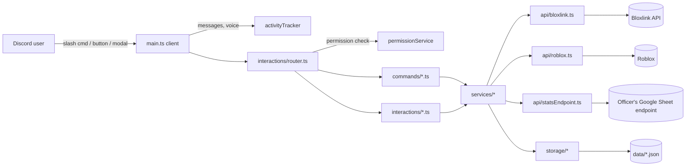
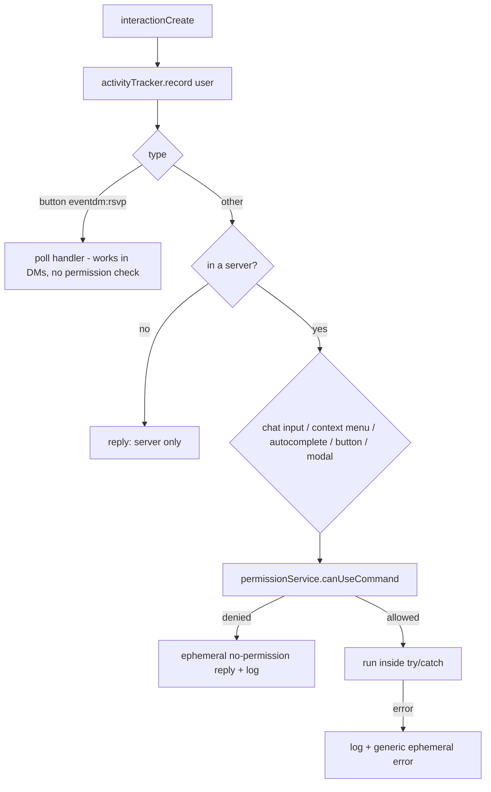
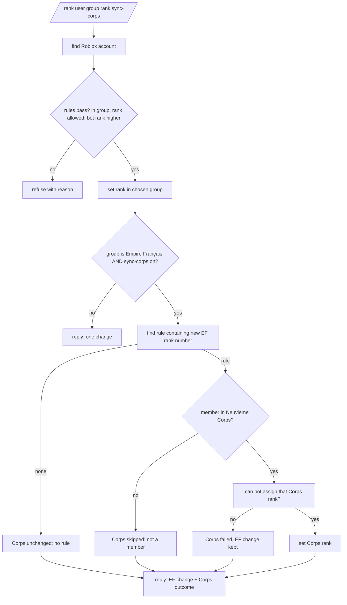
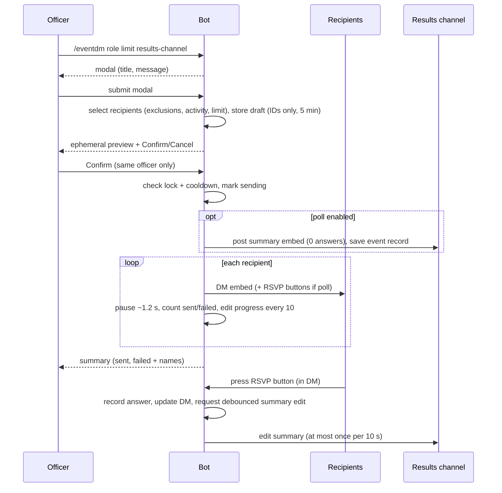

# Design Document

## Overview

This document describes how GroupManagementBot is built **as it stands today** (the full feature set from
`requirements.md` is implemented). It follows a consistent style: small files, one command per file, no giant
modules.

Guiding rules the code follows:

1. Layered architecture: `commands` / `interactions` → `services` → `api` and `storage`; `ui`, `utils`, and
   `config` may be imported by anyone. Never import upwards.
2. Shared logic lives in `services/`, `api/`, `ui/`, or `utils/` — never in `main.ts` or `init.ts`.
3. Stay light: this runs on a small EC2 instance. No big SDKs, bounded caches, minimal Discord intents.
4. Stay readable: a junior developer should be able to follow any file top to bottom.
5. Never touch secrets: `.env.ci` is encrypted with dotenvx and must stay that way.

**Testing scope:** every service is unit-tested with fake dependencies (no network, no real secrets). The bot
does **not** create the Google Apps Script, register commands with Discord automatically, or test against live
Discord/Roblox. The Stats Endpoint format is documented below so the bot side agrees with the separately
created script.

### Command module contract

Each command file exports `data` (a `SlashCommandBuilder`/`ContextMenuCommandBuilder`), an `access` level
(`public` | `configurable` | `admin`), and `execute(interaction)`. Some also export an `autocomplete(...)`
handler and a `configure(...)` function that injects a store or service at startup. `commands/index.ts`
collects the slash commands into `commands` and the context-menu commands into `userContextMenus`; both
`main.ts` (via the router) and `deploy-commands.ts` read from it.

### Build and deploy

`tsup src/main.ts --minify` bundles `dist/main.js`. CD copies `dist/`, `package.json`, `package-lock.json`, and
`.env.ci` to `/home/ubuntu/prod-GroupManagementBot`, runs `npm ci --omit=dev --ignore-scripts`, then runs the
bot with `dotenvx run -- pm2 start dist/main.js --name GroupManagementBot`. `deploy-commands.ts` is not part of
the build; it is run manually with `npm run deploy-commands` after any command definition changes.

> Installs use `--ignore-scripts` because noblox.js has a decorative `postinstall` figlet banner that can crash
> on a missing font; it is not needed at runtime.

### Resolved from the original codebase

The initial repository had the Bloxlink fetch inline in `acceptuser.ts`, TODO-only `rankuser.ts`/`promote.ts`,
an unguarded `interactionCreate` handler, over-broad intents (including the memory-hungry Presence intent), and
env-coupled constants. These have all been resolved: external calls are extracted into `api/`, the router
centralises dispatch and error handling, intents are minimal (`Guilds`, `GuildMembers`, `GuildMessages`,
`GuildVoiceStates`), constants live in `config/constants.ts`, `promote.ts` is deleted, and the unused
`github-actions-test.yml` workflow is removed. `DISCORD_CORPS_ID` remains the name of the **Discord server ID**
(kept for backward compatibility with tests); `config/constants.ts` exposes it as `DISCORD_SERVER_ID` with a
clarifying comment.

---

## Architecture

### Folder layout (as built)

```
src/
├─ init.ts                       # env validation; re-exports constants (env, groups, getCorpsID)
├─ main.ts                       # thin: client, stores, service wiring, router, activity events, shutdown
├─ deploy-commands.ts            # REST helper: registers slash + context-menu commands (run manually)
├─ config/
│  ├─ constants.ts               # MANAGED_GROUPS, GroupKey, getManagedGroup, DISCORD_SERVER_ID, LIMITS
│  └─ rankSync.ts                # Rank Sync Table (data only) + RankSyncRule type
├─ commands/
│  ├─ index.ts                   # commands registry + userContextMenus registry
│  ├─ types.ts                   # AccessLevel, BotCommand, UserContextMenuCommand
│  ├─ ping.ts                    # /ping (public)
│  ├─ acceptuser.ts              # /accept
│  ├─ whois.ts                   # /whois
│  ├─ robloxinfo.ts              # "Roblox Info" user context menu
│  ├─ rankuser.ts                # /rank (with Corps sync)
│  ├─ eventdm.ts                 # /eventdm
│  ├─ eventdmexclusions.ts       # /eventdm-exclusions
│  ├─ permissions.ts             # /permissions (admin)
│  ├─ userinfo.ts                # /userinfo
│  ├─ statssource.ts             # /stats-source (add/list/remove/edit/test + field-* subcommands)
│  └─ statsalias.ts              # /stats-alias
├─ interactions/                 # everything that is not a slash command
│  ├─ router.ts                  # single entry point: guild check, permission check, dispatch, error handling
│  ├─ customId.ts                # build/parse custom IDs like "eventdm:confirm:ab12cd34"
│  ├─ eventDmInteractions.ts     # modal submit + Confirm/Cancel buttons + RSVP buttons
│  └─ statsSourceInteractions.ts # modal submit for endpoint URL/secret
├─ api/                          # thin wrappers over anything outside the process (easy to fake in tests)
│  ├─ bloxlink.ts
│  ├─ roblox.ts                  # noblox wrappers + bot user ID
│  └─ statsEndpoint.ts           # calls a Google Apps Script endpoint
├─ services/                     # business logic; dependencies are passed in so tests can fake them
│  ├─ robloxAccount.ts           # Discord user -> RobloxAccount (bloxlink + small cache)
│  ├─ accountLookup.ts           # configured singleton for findRobloxAccount (wires env + api)
│  ├─ robloxInfo.ts              # group rank lines + headshot for /whois and the context menu
│  ├─ groupAccess.ts             # "can the bot assign this rank" rules (pure)
│  ├─ rankSyncService.ts         # pure: EF rank -> Corps rank name / validation of the table
│  ├─ rankService.ts             # set rank in one group, then optional Corps sync
│  ├─ rankServiceInstance.ts     # configured singleton for the rank service
│  ├─ permissionService.ts       # isAllowed (pure) + canUseCommand(), add/remove/list/reset roles
│  ├─ activityTracker.ts         # last-active timestamps, lazy save (no repeating timer)
│  ├─ activityTrackerInstance.ts # configured singleton over activity.json
│  ├─ recipientSelector.ts       # pure: who receives an event DM
│  ├─ eventDmService.ts          # pending previews, lock/cooldown, send loop
│  ├─ eventDmInstance.ts         # configured singleton for the event-DM service
│  ├─ pollService.ts             # RSVP recording, summary data, debounced summary edit
│  ├─ pollServiceInstance.ts     # configured singleton for the poll service
│  ├─ statsService.ts            # search sources, name list, cache
│  ├─ statsServiceInstance.ts    # configured singleton for the stats service
│  ├─ statsFields.ts             # pure: add/remove/move/validate stats-source fields
│  └─ statsFormatter.ts          # sheet row + field config -> embed fields (pure)
├─ storage/
│  ├─ jsonFile.ts                # generic load/atomic-save helper used by the stores
│  ├─ paths.ts                   # getDataDir() (DATA_DIR or <cwd>/data), dataFilePath()
│  ├─ settingsStore.ts           # SettingsStore interface + JSON implementation
│  ├─ eventStore.ts              # polls / event records (prune to 20 records / 30 days)
│  └─ types.ts                   # Settings, StatsSource, StatField, EventRecord, ActivityFile + defaults
├─ ui/
│  ├─ embeds.ts                  # success/warn/error, roblox info, event DM, poll summary, stats embeds
│  └─ messages.ts                # shared user-facing text
└─ utils/
   ├─ ttlCache.ts                # tiny bounded cache with expiry
   ├─ sleep.ts
   └─ text.ts                    # truncate(), normaliseName() (lowercase + trim)

data/                            # runtime only, git-ignored: settings.json, events.json, activity.json (+ .bak)
```

**Wiring pattern:** services and commands that need environment config or a store are wired once in
`main.ts`'s `bootstrap()` through a `configureX(...)` function, and reached elsewhere through a matching
`getX()` accessor (the `*Instance.ts` modules and the command `configure(...)` exports). This keeps `main.ts`
as the single composition root and avoids global state leaking across modules. Test files live next to the code
they test (`*.test.ts`).

Test files live next to the code they test (`rankSyncService.test.ts` beside `rankSyncService.ts`), matching the
existing `main.test.ts` style.

**Dependency direction (never import upwards):** `commands / interactions` → `services` → `api` and `storage`.
`ui`, `utils` and `config` may be imported by anyone. Services never import command builders; only `commands/`
and `interactions/` talk to Discord interaction objects.

### Component overview



### Interaction router flow



- Autocomplete returns an empty list for members who could not run the command anyway.
- Button and modal handlers are found by custom ID prefix (`eventdm`, `statssource`). Each handler declares which
  command name it belongs to so the same permission check applies.
- Custom IDs are `feature:action:id[:extra]` (max 100 characters), built and parsed only by `customId.ts`.
- If a reply was already deferred or sent when an error occurs, the router uses `followUp`/`editReply`.

### Rank change with Corps sync



### Event DM flow



### Discord client and memory settings

In `main.ts`:

```ts
const client = new Client({
  intents: [
    GatewayIntentBits.Guilds,
    GatewayIntentBits.GuildMembers,      // privileged, already enabled for the bot
    GatewayIntentBits.GuildMessages,     // only to see WHO sent a message (activity); content is never read
    GatewayIntentBits.GuildVoiceStates,  // voice joins count as activity
  ],
  makeCache: Options.cacheWithLimits({
    MessageManager: 0, ReactionManager: 0, PresenceManager: 0,
    GuildMemberManager: 200,
  }),
});
```

- `GuildMessages` and `GuildVoiceStates` are not privileged, so no Developer Portal change is needed.
- Buttons pressed inside a DM arrive as normal interactions, so `DirectMessages` is not needed.
- On `SIGINT` and `SIGTERM` (pm2 sends SIGINT on stop/restart) the bot saves activity, then destroys the client
  and exits.
- No repeating timers anywhere. Caches expire lazily when read.

---

## Components and Interfaces

### Command module contract

Existing style is kept: each command file has named exports. One new export, `access`, is added.

```ts
// src/commands/types.ts
export type AccessLevel = "public" | "configurable" | "admin";

export type BotCommand = {
  data: { name: string; toJSON(): unknown };  // SlashCommandBuilder or ContextMenuCommandBuilder
  access: AccessLevel;
  execute(interaction: ChatInputCommandInteraction): Promise<void>;
  autocomplete?(interaction: AutocompleteInteraction): Promise<void>;
};
```

`commands/index.ts` keeps `export const commands = { ping, accept, ... }` and adds `userContextMenus`.
`deploy-commands.ts` maps both to JSON. Commands are created with `setDMPermission(false)`.

Header comment template for every command file:

```ts
// /rank
// Arguments: user (Discord user), group (empire-francais | neuvieme-corps), rank (autocomplete), sync-corps (optional)
// Access: configurable
// What it does: sets a member's rank in one managed group; from Empire Français it also updates the Corps rank.
```

Access levels: `ping` public; `permissions` admin; everything else `configurable`. (An admin makes a command
public by running `/permissions add` with `@everyone`.)

### Managed groups and limits

```ts
// src/config/constants.ts
export const MANAGED_GROUPS = [
  { key: "main",  label: "Empire Français", id: 5610765 },
  { key: "corps", label: "Neuvième Corps",  id: 13206132 },
] as const;
export type GroupKey = (typeof MANAGED_GROUPS)[number]["key"];

export const LIMITS = {
  httpTimeoutMs: 8000,
  robloxIdCacheMax: 200,        robloxIdCacheTtlMs: 5 * 60_000,
  groupRolesCacheTtlMs: 5 * 60_000,
  statsCacheMax: 100,           statsCacheTtlMs: 60_000,
  maxStatsSourcesAtOnce: 3,     maxAliasesPerPlayer: 10,     maxOldUsernames: 10,
  eventDmMaxRecipients: 250,    eventDmDelayMs: 1200,        eventDmCooldownMs: 5 * 60_000,
  eventDmPreviewTtlMs: 5 * 60_000,  eventDmProgressEvery: 10,
  pollOpenMs: 72 * 60 * 60_000, pollSummaryEditGapMs: 10_000,
  pollMaxStored: 20,            pollMaxAgeMs: 30 * 24 * 60 * 60_000,
  pollNamesPerAnswer: 20,
  activityFlushGapMs: 5 * 60_000, activityMaxEntries: 5000, activityMaxAgeMs: 90 * 24 * 60 * 60_000,
} as const;
```

`getManagedGroup(key)` returns the group and throws on an unknown key. Slash commands build the `group` option
with `addChoices(...MANAGED_GROUPS.map(g => ({ name: g.label, value: g.key })))`. The **key** is the choice
value, never a raw ID. No code path accepts a group ID from user input.

### Shared account type

```ts
export type RobloxAccount = { userId: number; username: string; profileUrl: string };

export type LookupResult =
  | { ok: true; account: RobloxAccount }
  | { ok: false; reason: "not_linked" | "bloxlink_error" | "timeout" };
```

`services/robloxAccount.ts` exposes `findRobloxAccount(discordUserId): Promise<LookupResult>`. Commands switch on
`reason` and use text from `ui/messages.ts`. Bloxlink call used today:
`GET https://api.blox.link/v4/public/guilds/{guildId}/discord-to-roblox/{discordId}` with the `Authorization`
header; success returns `robloxID`.

### API layer (`src/api/`)

`api/roblox.ts` wraps noblox.js so services never import noblox directly:

- `getRankInGroup(groupId, userId): Promise<number>` (0 = not a member)
- `getRankNameInGroup(groupId, userId): Promise<string>`
- `getGroupRoles(groupId): Promise<GroupRole[]>` where `GroupRole = { id: number; name: string; rank: number }`
- `setRank(groupId, userId, rankNumber): Promise<void>`
- `getJoinRequest(groupId, userId)` and `handleJoinRequest(groupId, userId, accept)`
- `getIdFromUsername(username)` and `getUsername(userId)`
- `getPreviousUsernames(userId, limit): Promise<string[]>`. Kiro: inspect the installed `noblox.js` typings for a
  username-history helper; if none exists, call the public
  `GET https://users.roblox.com/v1/users/{userId}/username-history?limit=10&sortOrder=Desc` with the shared
  timeout. Return `[]` on any failure.
- `getHeadshotUrl(userId): Promise<string | null>`
- `getBotUserId(): number` — stored from the `noblox.setCookie(...)` result in `main.ts`.

`api/bloxlink.ts`: `fetchRobloxIdForDiscordUser(discordId)` using `AbortSignal.timeout(LIMITS.httpTimeoutMs)`.
HTTP 404 or a "not linked" error body → `not_linked`; network failure → `bloxlink_error`; abort → `timeout`.

All api functions log a short line on failure (never URLs containing secrets, never headers).

### Permission service

```ts
canUseCommand(command: { name: string; access: AccessLevel }, member: GuildMember): boolean
```

Rules, in order:
1. `public` → allowed.
2. Member has Discord `Administrator` → allowed.
3. `admin` → denied.
4. `configurable`: allowed if the member has any role in `settings.commandRoles[commandName]`, or the list
   contains the guild ID (the `@everyone` role ID equals the guild ID). An empty or missing list → denied.

A pure function of `(access, allowedRoleIds, memberRoleIds, isAdmin, guildId)` sits underneath so it is easy to
test. `addRole`, `removeRole`, `listRoles`, `resetCommand` only accept command names that exist in the registry
with `access === "configurable"`.

### Ranking services

`groupAccess.ts`:

```ts
canBotAssign(botRank: number, targetRank: number, newRank: number): { ok: true } | { ok: false; why: string }
```
Rules: `newRank` not 0, not 255, and `< botRank`; `targetRank` not 0 (not a member) and `< botRank`.

`rankSyncService.ts` (pure functions, no Roblox calls):

```ts
findSyncRule(efRank: number, rules: RankSyncRule[]): RankSyncRule | null
validateRankSyncRules(rules: RankSyncRule[]): string[]           // list of problems: overlaps, min > max, covers 0 or 255
findMissingCorpsRoles(rules: RankSyncRule[], corpsRoles: GroupRole[]): string[]   // rule names not found (case-insensitive)
```

`rankService.ts`:

```ts
type RankOutcome = { oldRankName: string; newRankName: string; changed: boolean };

type CorpsSyncOutcome =
  | { status: "off" }                                   // sync-corps turned off, or ranking was in Neuvième Corps
  | { status: "no_rule" }                               // new EF rank is in no rule
  | { status: "not_member" }
  | { status: "unchanged"; rankName: string }
  | { status: "changed"; oldRankName: string; newRankName: string }
  | { status: "failed"; reason: string };

setRankWithSync(input, deps): Promise<{ main: RankOutcome; corps: CorpsSyncOutcome } | { refused: string }>
```

Steps: check membership and `canBotAssign` → no-op if same rank → `setRank` → if group is EF and `syncCorps` →
`findSyncRule` → check Corps membership → resolve the Corps role by name from cached roles → `canBotAssign` →
`setRank` in Corps. A Corps failure never undoes the EF change.

`getGroupRoles` results are cached per group for 5 minutes. Autocomplete filters cached names by the typed text
and returns at most 25 choices; the choice **value** is the rank number.

At startup (`ready`), `main.ts` calls `validateRankSyncRules` and `findMissingCorpsRoles` and logs a warning for
each problem.

### Activity tracker

```ts
interface ActivityTracker {
  record(userId: string): void;               // memory update; marks data as changed
  getLastActive(userId: string): number;      // 0 when unknown
  saveIfDue(): Promise<void>;                 // saves if changed and 5 minutes passed since last save
  saveNow(): Promise<void>;                   // used on shutdown
}
```

- `record` is called from `messageCreate` (non-bot, in the configured server), `voiceStateUpdate` (user joined or
  moved to a channel), and the router (any interaction in the server). It then calls `saveIfDue()` without
  awaiting (errors are caught and logged).
- Backing data is a `Map<string, number>`; on save, entries older than 90 days are dropped and, if more than 5000
  remain, the oldest are dropped.
- Message content is never read, stored or logged.

### Recipient selection (pure)

```ts
type Candidate = { id: string; isBot: boolean; roleIds: string[]; joinedAt: number };

selectRecipients(input: {
  candidates: Candidate[];        // members holding the target role
  senderId: string;
  excludedRoleIds: string[];
  limit: number;                  // 1..250
  lastActive: (userId: string) => number;
}): {
  recipients: Candidate[];
  eligibleCount: number;          // after removing bots, sender, excluded roles
  excludedCount: number;          // removed because of an excluded role
  senderSkipped: boolean;
}
```

Algorithm:
1. Remove bots and the sender.
2. Remove members holding any excluded role (count them).
3. Sort the rest by `lastActive` descending; ties (and members with 0 activity) by `joinedAt` descending, then by
   ID so the order is stable.
4. Keep the first `limit`.

Excluded members are removed in step 2, before step 4, so they never use up capacity; the next active eligible
member takes their place.

### Event DM service

- `pendingBroadcasts: Map<string, PendingBroadcast>`; max 20 entries; expired entries removed whenever the map is
  read or written.

```ts
type PendingBroadcast = {
  id: string;                    // crypto.randomUUID().slice(0, 8)
  requesterId: string; guildId: string;
  roleId: string; roleName: string;
  limit: number; resultsChannelId: string | null;
  title: string | null; message: string | null;   // filled when the modal is submitted
  recipientIds: string[]; displayNames: Record<string, string>;
  createdAt: number;
};
```
  Only IDs and display names are stored, never `GuildMember` objects.
- `/eventdm` stores a draft (without title/message) and opens the modal with custom ID `eventdm:modal:<id>`. The
  modal submit fills in title and message, builds the recipient list with `selectRecipients` (after one
  `guild.members.fetch()`), and shows the preview.
- Per-guild state `{ sending: boolean; lastFinishedAt: number }` enforces the lock and 5-minute cooldown.
- `startSend(pending, sendOne, onProgress, sleepFn)` loops over recipients; `sendOne` is injected so tests can
  fake Discord. It never throws for a single failure; it records `{ sent, failed: [{id, name}] }`.
- DM embed: title, message, footer "Sent by <display name> from <server name>", `allowedMentions: { parse: [] }`.
  When a poll is enabled, three buttons with custom IDs `eventdm:rsvp:<eventId>:yes|maybe|no` are attached.
- After Confirm the preview's components are removed so a second click is impossible.

### Poll service (attendance)

```ts
type Answer = "yes" | "maybe" | "no";

recordAnswer(eventId: string, userId: string, answer: Answer, now: number):
  "recorded" | "closed" | "not_a_recipient" | "unknown_event"

buildSummary(event: EventRecord): { counts: Record<Answer, number>; noAnswer: number; dmFailed: number;
                                    names: Record<Answer, string[]> }   // names truncated to 20 each
```

- On Confirm with a poll: create an `EventRecord`, post the summary embed in the results channel, save the
  returned message ID, then start sending. Each successfully DM'd user is added to `recipientIds`; failures
  increase `dmFailed`.
- On an RSVP press (may happen in a DM, no guild): check the event exists and is open (`now < closesAt`), check the
  user is in `recipientIds`, store the answer (replacing an earlier one), update the DM message to show
  "Your answer: …" with the buttons kept, and call `requestSummaryEdit(eventId)`.
- `requestSummaryEdit`: if a timer for that event already exists, do nothing; otherwise `setTimeout` for up to
  10 seconds (`unref()`), and when it fires, edit the summary message once and delete the timer. This is the only
  timer the bot uses, and there is at most one per active poll.
- If the poll is closed, the RSVP handler updates the DM to remove the buttons and says the poll is closed.
- Failure to edit the summary (deleted message, no access) is logged and ignored.

### Stats Endpoint contract (external; the script itself is out of scope)

The bot sends one HTTPS `POST` per source lookup with `Content-Type: application/json` and follows redirects
(Google web apps answer through a redirect). All tests use a fake `fetch`.

**Request body**

```json
{
  "secret": "shared-secret",
  "tab": "Roster",
  "headerRow": 4,
  "startColumn": "C",
  "usernameHeader": "Roblox Username",
  "usernames": ["CurrentName", "OldName1", "OldName2", "ManualAlias"],
  "headers": ["Rank", "Kills", "Deaths", "Events Attended"]
}
```

**Success response**

```json
{
  "ok": true,
  "found": true,
  "matchedUsername": "OldName1",
  "row": { "Rank": "Sergeant", "Kills": 512, "Deaths": 218, "Events Attended": 14 },
  "missingHeaders": []
}
```

`found: false` has no `row`. **Error response:** `{ "ok": false, "error": "BAD_SECRET" | "TAB_NOT_FOUND" |
"HEADER_NOT_FOUND" | "BAD_REQUEST" | "INTERNAL" }`.

`api/statsEndpoint.ts` parses the JSON, checks the shape with a hand-written type guard, and turns anything
unexpected into `{ ok: false, error: "BAD_RESPONSE" }`. The URL host must be `script.google.com` or
`script.googleusercontent.com`, checked when saving **and** before every call. The URL and secret are never logged.

### Stats services

`statsService.findPlayerStats(account, sourceId?)`:

1. Build the name list: `[currentUsername, ...previousUsernames (max 10), ...aliases[userId]]`, remove
   duplicates using `normaliseName` but keep the original spelling for the request.
2. Pick enabled sources (all, or the chosen one).
3. Query sources with at most 3 in flight (a simple worker loop, no library).
4. Cache by `sourceId:userId` for 60 seconds, max 100 entries.
5. Return `{ results: SourceResult[]; failures: { sourceName: string; error: string }[] }`, where a
   `SourceResult` holds the source, the row, `matchedUsername`, and `matchedByOldName`.

`statsFormatter.ts` (pure, most heavily tested):
- `formatValue(raw, format)`: blank or `null` → `"—"`; `number` → `toLocaleString("en-US")`; `percent` → append
  `%` (if the sheet stores a fraction such as `0.85`, show `85%`; document the rule in a comment).
- `formatRatio(numerator, denominator)`: denominator 0 or non-number → `"—"`; otherwise two decimals.
- `buildEmbedFields(fields, row)` → `{ name, value, inline }[]`, names cut to 256 and values to 1024 characters,
  at most 25 fields.

### `/userinfo` embed layout

```
┌────────────────────────────────────────────┐
│ [headshot]  Sergeant Dubois                │  title: Roblox username (linked to profile)
│             EF: Adjudant · Corps: NCO      │  description: rank in each managed group
├────────────────────────────────────────────┤
│ Rank        Kills      Deaths     K/D      │  inline fields in configured order
│ Sergeant    512        218        2.35     │
│ Events Attended                            │
│ 14                                         │
├────────────────────────────────────────────┤
│ 1st Regiment · Alpha Company               │  footer: source name (+ "matched old name: X")
└────────────────────────────────────────────┘   accent colour = source.accentColor
```

Up to 3 embeds (one per matching source) in one reply. No "last updated" is shown because sheets have no
reliable value for it.

### `/stats-source` and `/stats-alias`

- `add`: slash options (name, tab, header-row, username-header, start-column) are stored in a small pending map
  (TTL 5 minutes, IDs and plain values only). A modal collects URL and secret. On submit: validate the host, call
  the endpoint with `usernames: ["__connection_test__"]` and the configured headers, and save only if it
  succeeds. Reply explains failures using the error codes.
- `field-add` options: `source` (autocomplete), `header`, `label`, `format` (choices), `inline` (boolean).
  `field-add-ratio` options: `source`, `numerator`, `denominator`, `label`.
- `list` shows each source with URL host only, tab, header row, field count. **Never** the secret or full URL.
- Autocomplete on `source` reads names from settings, max 25.

---

## Data Models

### Settings (`data/settings.json`)

```ts
export type StatFormat = "text" | "number" | "percent";

export type StatField =
  | { kind: "value"; header: string; label: string; format: StatFormat; inline: boolean }
  | { kind: "ratio"; numeratorHeader: string; denominatorHeader: string; label: string; inline: boolean };

export type StatsSource = {
  id: string;               // short slug, e.g. "reg1-a"
  displayName: string;      // "1st Regiment - Alpha Company"
  scriptUrl: string;        // never logged
  secret: string;           // never logged or shown
  tab: string;
  headerRow: number;        // 1-based row that holds the column headers
  startColumn: string;      // "A", "C", ... where the table starts
  usernameHeader: string;   // header text of the Roblox username column
  accentColor: number | null;
  enabled: boolean;
  fields: StatField[];
};

export type Settings = {
  version: 1;
  commandRoles: Record<string, string[]>;      // command name -> role IDs
  eventDmExcludedRoleIds: string[];
  statsSources: StatsSource[];
  usernameAliases: Record<string, string[]>;   // Roblox user ID (string) -> alternative names
};
```

### Events (`data/events.json`)

```ts
export type EventRecord = {
  id: string;
  title: string;
  guildId: string;
  createdBy: string;
  createdAt: number;
  closesAt: number;                       // createdAt + 72 h
  resultsChannelId: string;
  summaryMessageId: string | null;
  recipientIds: string[];                 // users whose DM was delivered
  displayNames: Record<string, string>;   // saved at send time so summaries need no member fetch
  dmFailedCount: number;
  answers: Record<string, "yes" | "maybe" | "no">;
};

export type EventFile = { version: 1; events: EventRecord[] };   // newest last, max 20, none older than 30 days
```

### Activity (`data/activity.json`)

```ts
export type ActivityFile = { version: 1; lastActive: Record<string, number> };  // user ID -> ms timestamp
```

### Storage behaviour (`storage/jsonFile.ts`)

| Option | Setup on AWS | Speed on a small instance | Verdict |
|--------|--------------|---------------------------|---------|
| **JSON files in `data/`** | Nothing to install | Reads come from memory; writes are rare and small | **Chosen** |
| SQLite file | One more dependency | Fast, but overkill for a few KB | Later, if data grows |
| DynamoDB / RDS | IAM roles, network, cost | Network latency per call | Only if the bot ever stores stats itself |

- `dataDir` = `process.env.DATA_DIR` or `<cwd>/data`. pm2 runs from `/home/ubuntu/prod-GroupManagementBot` and
  `scp` only adds or overwrites the listed files, so `data/` survives deployments.
- Load once at startup; create the file with defaults if missing. `settings.json` and `events.json` that cannot be
  parsed make the bot refuse to start (never overwritten). `activity.json` that cannot be parsed is renamed to
  `.corrupt` and replaced with an empty file, because losing activity history is harmless.
- Save: clone, apply the change, write `<file>.tmp`, copy the current file to `<file>.bak`, rename tmp over the real
  file, swap the in-memory copy. Saves go through one promise chain per file so two writes never overlap.
- `settings.json` is written with mode `0o600` where supported (it contains endpoint secrets).

```ts
export interface SettingsStore {
  get(): Readonly<Settings>;
  update(change: (draft: Settings) => void): Promise<void>;
}
```

### Rank Sync Table (`src/config/rankSync.ts`) — confirmed by the owner

```ts
export type RankSyncRule = { efMin: number; efMax: number; efLabel: string; corpsRoleName: string };

export const RANK_SYNC_RULES: RankSyncRule[] = [ /* rows below */ ];
```

Empire Français uses small rank numbers (owner 255; Maréchal 19 down to Citoyen 1). The Corps side is matched by
**role name** (not number). Confirmed mapping:

| EF tier | EF rank numbers | Corps rank it maps to |
|---------|-----------------|-----------------------|
| Citoyen, Conscrit, Soldat, Caporal, Caporal Fourrier | 1 – 5 | Militaire du Rang |
| Sergent, Sergent Major, Adjudant, Adjudant Sous-Officier | 6 – 9 | Sous-Officier |
| Bénéficiaire d'Empire (custom, retired officers) | 10 | *no rule: Corps rank is not changed* |
| Sous-Lieutenant, Lieutenant, Capitaine | 11 – 13 | Officier Subalterne |
| Chef de Bataillon, Major, Colonel | 14 – 16 | Officier Supérieur |
| Général de Brigade and up, Maréchal | 17 – 19 | *no rule: Corps appointments made manually* |
| Empereur des Français (owner) | 255 | *never synced* |

Rank 10 (Bénéficiaire d'Empire) sits between the NCO band (ends at 9) and the officer band (starts at 11), so it
has no rule by design. Ranks above Colonel have no rule because those Corps appointments are manual. If a Corps
role name does not exist in the Corps group, the startup check logs a warning and the sync reports a failure for
that rule (the EF change is still kept).

---

## Error Handling

| Situation | Behaviour |
|-----------|-----------|
| Bloxlink: not linked | Friendly message: the player must verify with Bloxlink |
| Bloxlink, Roblox or endpoint down or slow | Stop after 8 s; message names the failing part; other work continues |
| Roblox refuses a rank change | Pre-check catches most cases; if Roblox still errors, show "Roblox rejected the change" and log details |
| Corps sync cannot run | EF change is kept; reply lists the Corps outcome (`no_rule`, `not_member`, `failed`) |
| Interaction would time out (>3 s) | Every command that calls an API starts with `deferReply` |
| Uncaught exception in any handler | Router logs it (no secrets) and sends a generic ephemeral message |
| `settings.json` or `events.json` corrupt | Bot refuses to start with a clear message |
| DM closed or fails | Counted as failed, sending continues |
| Poll summary message gone | Logged; answers keep being recorded |
| Results channel invalid at `/eventdm` | Refuse before the modal opens |

Error replies are ephemeral. User-facing text lives in `ui/messages.ts`.

---

## Testing Strategy

- Framework: vitest, files named `*.test.ts` beside the source. `npm run tests` (via dotenvx) stays the entry
  point used by CI. `npm run typecheck` is added.
- **Do not import `init.ts` in new tests.** Pure modules import from `config/constants.ts`.
- Services receive api functions as parameters (or through a `createXService(deps)` factory), so tests pass fakes.
  No network, no real tokens, no real Discord.
- Must-have tests:
  - `ttlCache` expiry and size cap; `normaliseName`, `truncate`.
  - `canBotAssign`; `findSyncRule`, `validateRankSyncRules` (overlap, min > max, covers 0/255, the shipped table
    itself is valid), `findMissingCorpsRoles`; `setRankWithSync` for every `CorpsSyncOutcome`.
  - `canUseCommand` rules and permission add/remove/reset.
  - `selectRecipients`: excluded members do not use capacity, sender skipped, bots skipped, activity order,
    no-activity fallback, limit respected.
  - `eventDmService`: lock, cooldown, only requester, expiry, continues after failures.
  - `pollService`: replace answer, closed poll, non-recipient ignored, summary counts and name truncation,
    debounce (fake timers), missing summary message does not throw.
  - `activityTracker`: lazy save gap, pruning, entry cap, corrupt file fallback.
  - `jsonFile` / stores: create defaults, save and reload, `.bak`, queued writes, corrupt file handling.
  - `statsEndpoint` type guard and host check; `statsFormatter`; `statsService` (old-name match, alias match,
    one source failing, cache hit, history fetch failing).
  - `parseCustomId`.
- The existing `main.test.ts` keeps passing unchanged.

---

## Implementation Conventions

**Working rules for Kiro**
- Do the tasks in order. Leave the project compiling (`npm run typecheck`) and tests passing (`npm run tests`)
  after each top-level task.
- Do not implement anything that is not in `tasks.md`.
- Never read, print, decrypt or commit `.env.keys`. Never edit `.env.ci` by hand. No new secrets are required.
- Do not change the deploy logic in `cd.yml`. The only workflow change is adding a typecheck step to `ci.yml`
  (and a `pull_request` trigger).

**CI/CD**
- `package.json`: add `"typecheck": "tsc --noEmit"`; change `deploy-commands` to run `tsx` instead of `tsx watch`.
- `ci.yml`: add `npm run typecheck` before the tests step; also trigger on `pull_request`.
- Delete `github-actions-test.yml`. Add `data/` to `.gitignore`.
- Registering commands stays a manual step (`npm run deploy-commands`) after any command definition changes; the
  README says so.

**Structure**
- One command per file in `commands/`, one job per file elsewhere. Split a file when it passes ~200 lines.
- Commands only read options, call services, and build the reply. No API calls or business rules inside them.
- New shared logic goes in `services/`, `api/`, `ui/` or `utils/`, never in `main.ts` or `init.ts`.

**Readability (junior level)**
- Descriptive names (`getBotRankInGroup`, not `getBR`). Small functions, early returns, no nested ternaries.
- `const`/`let`, never `var`. No `any`; use `unknown` plus a type guard when parsing outside data.
- Explicit return types on exported functions and a one-line comment above each saying what it does.
- Comments explain why. Avoid `reduce` chains when a plain loop is clearer. Always `await` interaction replies.

**Efficiency**
- Every cache and map has a max size and a TTL. No timer per entry. Never keep full member lists or sheets in
  memory after a request finishes.

**Security**
- Never print, log, echo or commit secrets, cookies, endpoint URLs, or `.env.keys`.
- Validate every external response before use. Treat Discord input as untrusted (lengths, allowed hosts, allowed
  groups). Use ephemeral replies for anything containing settings.

**Discord limits to respect**
- 25 autocomplete choices, 25 embed fields, 256-character field names, 1024-character field values, 6000
  characters per embed, 100-character custom IDs, 5 buttons per row, modal text field max 4000.
